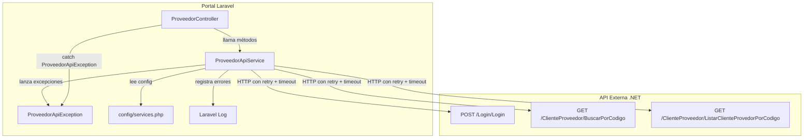
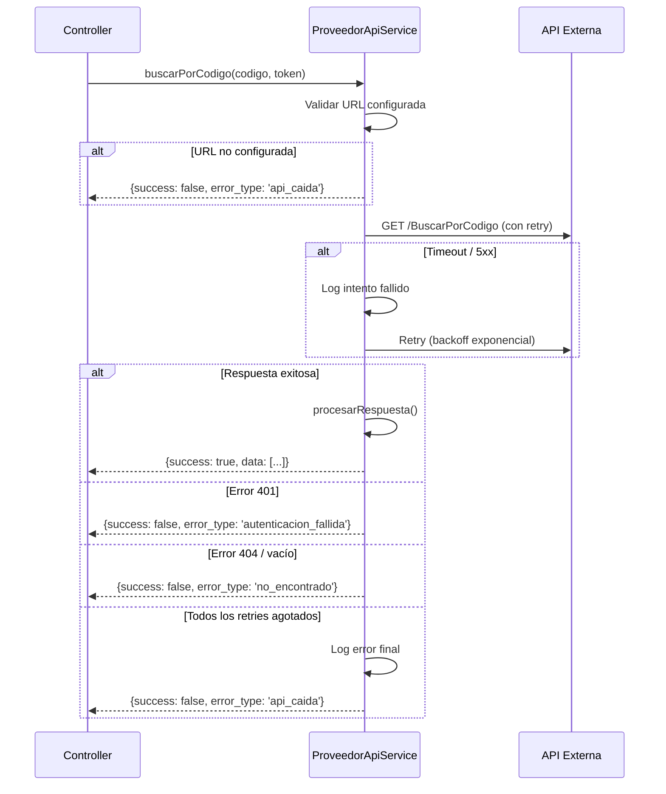

# Design Document: Blindar ProveedorApiService

## Overview

Este diseño describe cómo transformar el `ProveedorApiService` actual (que no tiene manejo de errores) en un servicio resiliente con timeouts configurables, retry con backoff exponencial, excepciones tipadas y respuestas estandarizadas. El servicio sigue siendo la única capa de comunicación entre el portal Laravel y la API externa .NET de Alan Osorio.

### Decisiones de Diseño Clave

1. **Excepción personalizada con factory methods**: `ProveedorApiException` usa métodos estáticos para crear instancias tipadas, facilitando el catch granular en controllers.
2. **Respuesta estandarizada como array asociativo**: Se usa un array `['success', 'data', 'message', 'error_type']` en lugar de un DTO/Value Object para mantener simplicidad y compatibilidad con el código existente de los controllers.
3. **Retry solo en operaciones idempotentes**: Login NO se reintenta (no es idempotente respecto a intentos de contraseña). Solo GET requests y errores transitorios (5xx, timeout) se reintentan.
4. **Configuración centralizada en `config/services.php`**: Todos los parámetros (URL, timeouts, retries) se leen de config, con valores por defecto razonables.
5. **Uso del HTTP Client de Laravel**: Se aprovecha `Http::timeout()`, `Http::connectTimeout()` y `Http::retry()` nativos de Laravel 12 en lugar de implementar retry manual.

## Architecture



### Flujo de una llamada típica (buscarPorCodigo)



## Components and Interfaces

### 1. ProveedorApiException (`app/Exceptions/ProveedorApiException.php`)

Excepción personalizada que encapsula errores de la API externa.

```php
class ProveedorApiException extends \Exception
{
    // Propiedades
    private string $errorType;
    private int $httpCode;
    private array $responseData;

    // Tipos de error (constantes)
    const API_CAIDA = 'api_caida';
    const TIMEOUT = 'timeout';
    const AUTENTICACION_FALLIDA = 'autenticacion_fallida';
    const NO_ENCONTRADO = 'no_encontrado';
    const ERROR_SERVIDOR = 'error_servidor';
    const ERROR_VALIDACION = 'error_validacion';
    const ERROR_DESCONOCIDO = 'error_desconocido';

    // Factory methods
    public static function apiCaida(string $mensaje, int $httpCode = 0): self;
    public static function timeout(string $endpoint): self;
    public static function autenticacionFallida(): self;
    public static function noEncontrado(string $recurso): self;
    public static function errorServidor(int $httpCode, string $mensaje): self;
    public static function errorValidacion(string $mensaje, array $data = []): self;
    public static function errorDesconocido(string $mensaje, int $httpCode = 0): self;

    // Getters
    public function getErrorType(): string;
    public function getHttpCode(): int;
    public function getResponseData(): array;
}
```

### 2. ProveedorApiService (`app/Services/ProveedorApiService.php`)

Servicio refactorizado con resiliencia completa.

```php
class ProveedorApiService
{
    private string $baseUrl;
    private int $connectTimeout;
    private int $timeout;
    private int $maxRetries;

    public function __construct();

    // Métodos públicos
    public function loginApi(string $codigo, string $pwd): array;
    public function buscarPorCodigo(string $codigo, string $token): array;
    public function listarPorCodigo(string $codigo, string $token): array;

    // Métodos privados
    private function procesarRespuesta(Response $response, string $endpoint): array;
    private function buildSuccessResponse(array $data): array;
    private function buildErrorResponse(string $message, string $errorType): array;
    private function validarConfiguracion(): void;
}
```

### 3. Configuración (`config/services.php`)

```php
'proveedor_api' => [
    'url'             => env('PROVEEDOR_API_URL', ''),
    'connect_timeout' => (int) env('PROVEEDOR_API_CONNECT_TIMEOUT', 5),
    'timeout'         => (int) env('PROVEEDOR_API_TIMEOUT', 15),
    'max_retries'     => (int) env('PROVEEDOR_API_MAX_RETRIES', 3),
],
```

### Interfaz de Respuesta Estandarizada

Todos los métodos públicos retornan:

```php
[
    'success'    => bool,
    'data'       => array|null,
    'message'    => string,
    'error_type' => string|null,  // null cuando success=true
]
```

## Data Models

### DTOs de la API Externa (referencia, no se crean clases PHP)

Los datos de la API se manejan como arrays asociativos. No se crean DTOs en PHP porque la API aún no está disponible y la estructura puede cambiar.

**DocumentoDto** (respuesta de BuscarPorCodigo y ListarClienteProvedorPorCodigo):
| Campo | Tipo | Descripción |
|-------|------|-------------|
| IdDocumento | int | Identificador único del documento |
| CodigoCteProv | string | Código del cliente/proveedor |
| Fecha | string | Fecha del documento |
| Folio | string | Folio del documento |
| Importe | float | Importe total |
| FechaVencimiento | string | Fecha de vencimiento |
| Referencia | string | Referencia del documento |
| Observacion | string | Observaciones |
| Movimientos | array | Lista de MovimientoDto |

**MovimientoDto** (dentro de DocumentoDto):
| Campo | Tipo | Descripción |
|-------|------|-------------|
| CodigoProducto | string | Código del producto |
| Unidades | float | Cantidad de unidades |
| Precio | float | Precio unitario |
| Impuesto1 | float | IVA aplicado |
| Total | float | Total del movimiento |

**LoginResponse** (respuesta de /Login/Login):
| Campo | Tipo | Descripción |
|-------|------|-------------|
| usuario | string | Datos del usuario autenticado |
| tokencreado | string | Token JWT para llamadas subsecuentes |

### Configuración (.env)

| Variable | Tipo | Default | Descripción |
|----------|------|---------|-------------|
| PROVEEDOR_API_URL | string | '' | URL base de la API externa |
| PROVEEDOR_API_CONNECT_TIMEOUT | int | 5 | Timeout de conexión en segundos |
| PROVEEDOR_API_TIMEOUT | int | 15 | Timeout de respuesta en segundos |
| PROVEEDOR_API_MAX_RETRIES | int | 3 | Máximo de reintentos en fallos transitorios |

## Correctness Properties

*A property is a characteristic or behavior that should hold true across all valid executions of a system — essentially, a formal statement about what the system should do. Properties serve as the bridge between human-readable specifications and machine-verifiable correctness guarantees.*

### Property 1: Construcción round-trip de ProveedorApiException

*For any* combinación de tipo de error (string), mensaje (string), código HTTP (int entre 0 y 599) y datos de respuesta (array), al construir una `ProveedorApiException` con esos valores, los getters `getErrorType()`, `getMessage()`, `getHttpCode()` y `getResponseData()` deben retornar exactamente los valores originales.

**Validates: Requirements 1.1**

### Property 2: Invariante de estructura de respuesta

*For any* llamada a un método público del `ProveedorApiService` (loginApi, buscarPorCodigo, listarPorCodigo), independientemente de si la API responde con éxito o error, el array retornado siempre debe contener exactamente las claves `success` (bool), `data` (array|null), `message` (string) y `error_type` (string|null). Además, cuando `success` es `true`, `error_type` debe ser `null` y `data` no debe ser `null`; cuando `success` es `false`, `data` debe ser `null` y `error_type` debe ser un string no vacío.

**Validates: Requirements 2.1, 2.2, 2.3**

### Property 3: Mapeo de código HTTP a tipo de error

*For any* código HTTP de respuesta, `procesarRespuesta` debe mapear: códigos 2xx a `success=true` con los datos del body; código 401 a `error_type='autenticacion_fallida'`; código 404 a `error_type='no_encontrado'`; códigos 5xx a `error_type='error_servidor'`; y cualquier otro código de error a un `error_type` definido. El mapeo debe ser determinista y consistente.

**Validates: Requirements 2.2, 2.3, 9.2, 9.3, 9.4, 9.5**

### Property 4: Retry en fallos transitorios respeta el máximo configurado

*For any* código HTTP retryable (500, 502, 503, 504) y *for any* valor de `max_retries` entre 1 y 5, cuando la API siempre falla con ese código, el servicio debe realizar exactamente `max_retries` intentos totales antes de retornar una respuesta con `error_type='api_caida'`.

**Validates: Requirements 4.1, 4.4**

### Property 5: Requests autenticados incluyen header y parámetros correctos

*For any* string `codigo` no vacío y *for any* string `token` no vacío, al invocar `buscarPorCodigo` o `listarPorCodigo`, la petición HTTP debe incluir el header `Authorization: Bearer {token}` y el query parameter `codigo={codigo}` exactamente como se proporcionaron.

**Validates: Requirements 7.1, 8.1**

### Property 6: URL vacía falla sin intentar llamada HTTP

*For any* valor de URL base que sea vacío (string vacío, null o solo whitespace), al invocar cualquier método público del servicio, debe retornar inmediatamente `success=false` con `error_type='api_caida'` sin realizar ninguna petición HTTP.

**Validates: Requirements 10.3**

## Error Handling

### Estrategia de Manejo de Errores por Capa

| Capa | Responsabilidad | Acción |
|------|----------------|--------|
| ProveedorApiService | Capturar excepciones HTTP, timeouts, errores de conexión | Retornar respuesta estandarizada con error_type apropiado |
| ProveedorController | Recibir respuesta estandarizada | Mostrar mensaje al usuario en español vía flash message |
| Middleware | N/A | No interviene en errores de API |

### Mapeo de Errores HTTP a Tipos de Error

| Código HTTP | error_type | Mensaje (español) |
|-------------|-----------|-------------------|
| 401 | `autenticacion_fallida` | "Credenciales inválidas o sesión expirada" |
| 404 | `no_encontrado` | "No se encontraron resultados" |
| 500, 502, 503, 504 | `error_servidor` (durante retry) / `api_caida` (después de agotar retries) | "La API del proveedor no está disponible temporalmente" |
| Timeout | `timeout` → `api_caida` (después de retries) | "La API no respondió a tiempo" |
| ConnectionException | `api_caida` | "No se pudo conectar con la API del proveedor" |
| URL no configurada | `api_caida` | "La API del proveedor no está configurada" |
| Cualquier otro | `error_desconocido` | "Ocurrió un error inesperado" |

### Excepciones que NO se reintentan

- **401 Unauthorized**: Error de autenticación, reintentar no lo resuelve.
- **404 Not Found**: El recurso no existe, reintentar no lo resuelve.
- **Login (POST /Login/Login)**: No es idempotente respecto a intentos de contraseña.

### Flujo de Error en el Controller

```php
$resultado = $this->apiService->buscarPorCodigo($codigo, $token);

if (!$resultado['success']) {
    return back()->with('error', $resultado['message']);
}

// Usar $resultado['data'] normalmente
```

## Testing Strategy

### Herramientas

- **PHPUnit 11.5** (ya instalado)
- **Mockery 1.6** (ya instalado) para mocks
- **Laravel Http::fake()** para simular respuestas de la API externa
- **PHPUnit Data Providers** para property-based testing (generación de múltiples inputs)

### Enfoque Dual: Unit Tests + Property Tests

**Unit Tests** (tests específicos con ejemplos concretos):
- Cada factory method de `ProveedorApiException` produce el tipo correcto
- Valores por defecto de configuración (5s, 15s, 3 retries)
- Login no reintenta en error 500
- Login retorna `autenticacion_fallida` en 401
- Respuesta vacía de API se mapea a `no_encontrado`
- Log se registra en cada intento fallido
- Log warning cuando hay éxito después de retries

**Property Tests** (con PHPUnit Data Providers para múltiples inputs, mínimo 100 iteraciones):
- Property 1: Construcción round-trip de excepción
- Property 2: Invariante de estructura de respuesta
- Property 3: Mapeo de código HTTP a tipo de error
- Property 4: Retry respeta máximo configurado
- Property 5: Requests autenticados con headers correctos
- Property 6: URL vacía falla sin HTTP

**Configuración de Property Tests:**
- Cada property test usa `@dataProvider` con generación aleatoria de al menos 100 casos
- Cada test incluye tag: `Feature: blindar-proveedor-api-service, Property {N}: {título}`
- Se usa `Faker` (ya en dev dependencies) para generar datos aleatorios

### Estructura de Tests

```
tests/
├── Unit/
│   └── Services/
│       ├── ProveedorApiServiceTest.php      # Unit tests + Property tests del servicio
│       └── ProveedorApiExceptionTest.php    # Unit tests + Property tests de la excepción
```

### Ejecución

```bash
php artisan test --filter=ProveedorApi
```
