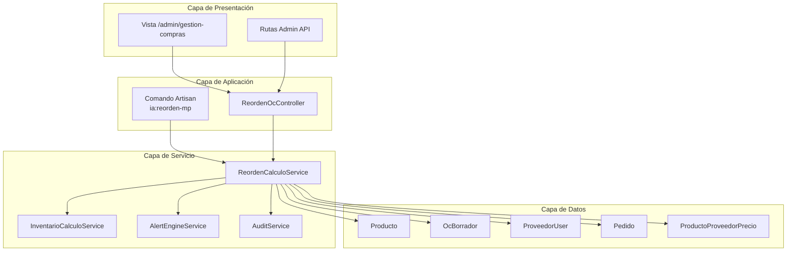
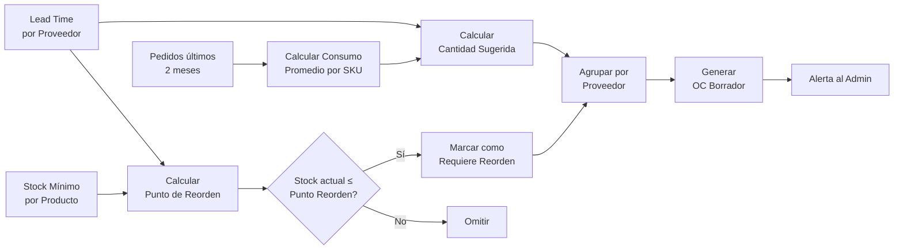
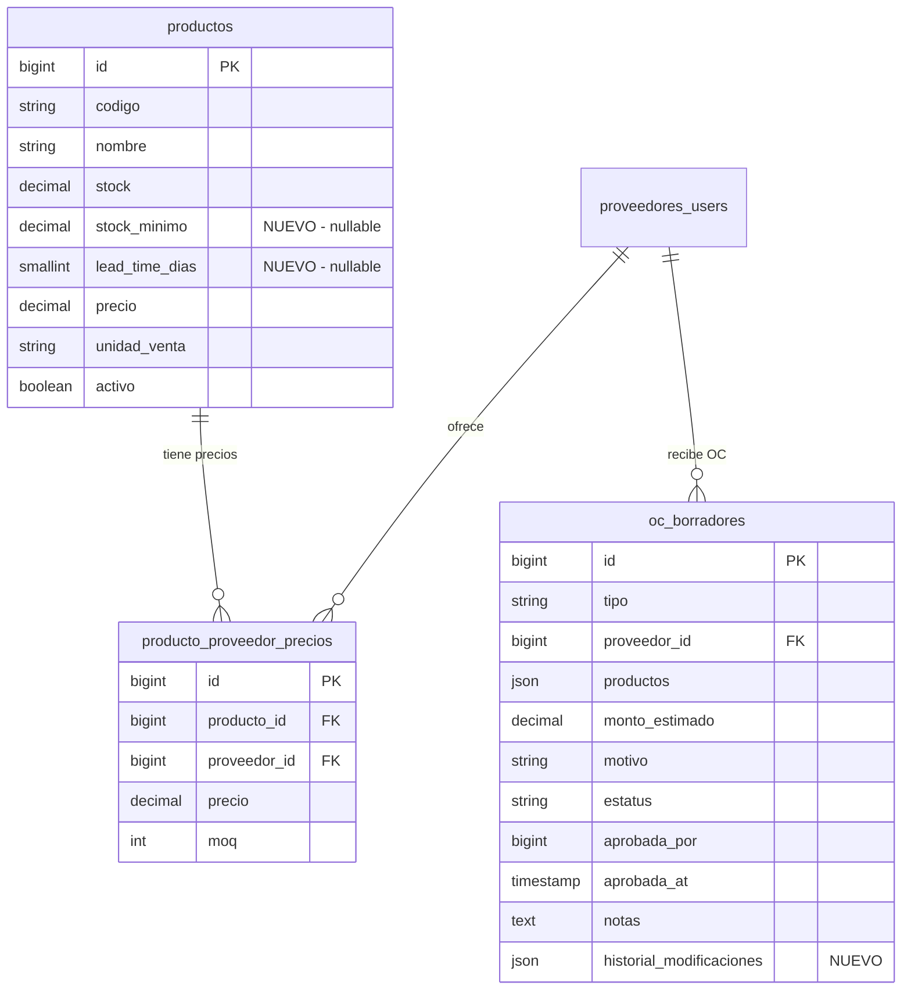

# Diseño Técnico: Generación Automática de OC de Materia Prima

## Visión General

Este módulo implementa la generación automática de Órdenes de Compra (OC) para materia prima en la aplicación Laravel existente de Industrias Salcom. El sistema calcula puntos de reorden basándose en consumo histórico (2 meses), aplica un margen de seguridad del 50%, considera lead times de proveedores, agrupa productos por proveedor, y genera borradores de OC para aprobación del administrador.

Se integra con los modelos existentes (`Producto`, `OcBorrador`, `ProveedorUser`, `Pedido`) y servicios (`InventarioCalculoService`, `AlertEngineService`, `AuditService`).

## Arquitectura

### Diagrama de Componentes



### Diagrama de Flujo de Datos



### Decisiones de Diseño

1. **Servicio separado (`ReordenCalculoService`)**: Se crea un servicio nuevo en lugar de extender `InventarioCalculoService` porque la lógica de reorden es un dominio distinto con su propia fórmula (2 meses + 50% seguridad). El servicio existente usa DDI de 90 días y fórmula de máximos/mínimos genérica.

2. **Reutilización del modelo `OcBorrador`**: El modelo existente ya soporta la estructura necesaria (tipo, proveedor_id, productos JSON, estatus). Solo se usa un tipo diferente: `automatica_reorden`.

3. **Columnas nuevas en `productos`**: Se agrega `stock_minimo` y `lead_time_dias` directamente en la tabla `productos` en lugar de tabla separada, ya que son atributos intrínsecos del producto y simplifican las consultas.

4. **Comando Artisan reutilizable**: Se crea `ia:reorden-mp` siguiendo el patrón de `ia:oc-trimestral` pero con la fórmula correcta y relaciones reales producto-proveedor.

## Componentes e Interfaces

### ReordenCalculoService

```php
namespace App\Services;

class ReordenCalculoService
{
    // Calcula consumo promedio mensual de un producto en los últimos 2 meses
    public function calcularConsumoPromedio(string $codigoProducto): float;

    // Aplica fórmula: ConsumoPromedio + (ConsumoPromedio × 0.50) + (ConsumoDiario × LeadTime)
    public function calcularCantidadSugerida(float $consumoPromedio, int $leadTimeDias): int;

    // Ajusta cantidad al múltiplo de MOQ superior
    public function ajustarAMOQ(int $cantidad, ?int $moq): int;

    // Punto de reorden = StockMinimo + (ConsumoDiario × LeadTime)
    public function calcularPuntoReorden(float $stockMinimo, float $consumoDiario, int $leadTimeDias): float;

    // Evalúa si un producto requiere reorden considerando pendientes de recibir
    public function requiereReorden(Producto $producto, float $puntoReorden, float $pendienteRecibir): bool;

    // Obtiene pendiente de recibir (OC aprobadas/en_proceso) para un producto
    public function obtenerPendienteRecibir(string $codigoProducto): float;

    // Selecciona el mejor proveedor para un producto (mayor score_total)
    public function seleccionarMejorProveedor(Producto $producto): ?ProveedorUser;

    // Genera OC borradores agrupados por proveedor
    public function generarOCBorradores(array $productosReorden): array;

    // Proceso completo: evalúa todos los productos y genera OC
    public function ejecutarProcesoReorden(): array;
}
```

### Comando Artisan: `ia:reorden-mp`

```php
namespace App\Console\Commands;

class IaReordenMateriaPrima extends Command
{
    protected $signature = 'ia:reorden-mp {--dry-run : Simular sin crear OC}';
    protected $description = 'Genera OC automáticas de materia prima basadas en punto de reorden';

    public function handle(): int;
}
```

### ReordenOcController

```php
namespace App\Http\Controllers;

class ReordenOcController extends Controller
{
    // Lista OC borradores pendientes con resumen
    public function index(): View;

    // Detalle de una OC borrador específica
    public function show(OcBorrador $oc): View;

    // Aprobar una OC borrador
    public function aprobar(Request $request, OcBorrador $oc): RedirectResponse;

    // Rechazar una OC borrador
    public function rechazar(Request $request, OcBorrador $oc): RedirectResponse;

    // Modificar cantidades de productos en OC
    public function actualizarProductos(Request $request, OcBorrador $oc): RedirectResponse;

    // Eliminar producto de OC
    public function eliminarProducto(Request $request, OcBorrador $oc): RedirectResponse;

    // Agregar producto a OC
    public function agregarProducto(Request $request, OcBorrador $oc): RedirectResponse;

    // Ejecutar proceso de reorden manualmente
    public function ejecutarReorden(): RedirectResponse;

    // Importar stock mínimos desde Excel/CSV
    public function importarStockMinimos(Request $request): RedirectResponse;
}
```

## Modelos de Datos

### Migración: Agregar columnas a `productos`

```php
Schema::table('productos', function (Blueprint $table) {
    $table->decimal('stock_minimo', 12, 2)->nullable()->after('stock');
    $table->unsignedSmallInteger('lead_time_dias')->nullable()->after('stock_minimo');
});
```

### Migración: Agregar columna `historial_modificaciones` a `oc_borradores`

```php
Schema::table('oc_borradores', function (Blueprint $table) {
    $table->json('historial_modificaciones')->nullable()->after('notas');
});
```

### Estructura del campo JSON `productos` en OcBorrador (tipo automatica_reorden)

```json
[
    {
        "codigo": "MP-001",
        "nombre": "Harina de trigo",
        "cantidad_sugerida": 150,
        "unidad": "kg",
        "precio_unitario": 25.50,
        "subtotal": 3825.00,
        "stock_actual": 20,
        "punto_reorden": 75,
        "urgente": false
    }
]
```

### Estructura del campo JSON `historial_modificaciones`

```json
[
    {
        "fecha": "2025-01-15T10:30:00",
        "usuario_id": 1,
        "usuario_nombre": "Admin Compras",
        "accion": "modificar_cantidad",
        "producto_codigo": "MP-001",
        "valor_anterior": 150,
        "valor_nuevo": 200,
        "nota": "Ajuste por próxima temporada alta"
    }
]
```

### Diagrama ER (cambios)



## Propiedades de Correctitud

*Una propiedad es una característica o comportamiento que debe mantenerse verdadero en todas las ejecuciones válidas del sistema — esencialmente, una declaración formal sobre lo que el sistema debe hacer. Las propiedades sirven como puente entre especificaciones legibles y garantías de correctitud verificables por máquina.*


### Propiedad 1: Cálculo correcto de consumo promedio

*Para cualquier* conjunto de pedidos no cancelados en los últimos 2 meses, el consumo promedio de un producto debe ser igual a la suma total de unidades consumidas dividida entre la cantidad de meses con consumo (1 o 2). Pedidos cancelados y pedidos fuera de la ventana de 2 meses nunca deben influir en el resultado.

**Valida: Requerimientos 1.1, 1.2, 1.3, 1.4**

### Propiedad 2: Fórmula de cantidad sugerida con ajuste MOQ

*Para cualquier* consumo promedio ≥ 0 y lead time > 0, la cantidad sugerida debe ser igual a `ceil(ConsumoPromedio + ConsumoPromedio×0.50 + (ConsumoPromedio/30)×LeadTime)`. Cuando existe un MOQ, el resultado debe ser el menor múltiplo del MOQ que sea ≥ a la cantidad calculada.

**Valida: Requerimientos 2.1, 2.2, 2.4**

### Propiedad 3: Validación de stock mínimo positivo

*Para cualquier* valor numérico proporcionado como stock mínimo, el sistema solo debe aceptar valores estrictamente mayores a cero. Valores ≤ 0, nulos, o no numéricos deben ser rechazados.

**Valida: Requerimiento 3.2**

### Propiedad 4: Exclusión de productos sin stock mínimo

*Para cualquier* conjunto de productos activos, el proceso de reorden debe excluir todo producto que no tenga stock_minimo configurado (null). El resultado nunca debe contener productos sin stock_minimo.

**Valida: Requerimiento 3.4**

### Propiedad 5: Detección correcta de reorden con pendientes

*Para cualquier* producto con stock_minimo configurado, el punto de reorden es `stock_minimo + (consumo_diario × lead_time)`. Un producto requiere reorden si y solo si `(stock_actual + pendiente_recibir) ≤ punto_reorden`. Además, si stock_actual == 0, debe marcarse como "urgente".

**Valida: Requerimientos 4.1, 4.2, 4.3, 4.4**

### Propiedad 6: Agrupación correcta por proveedor con selección por score

*Para cualquier* conjunto de productos que requieren reorden, cada producto debe asignarse a exactamente un proveedor (el de mayor score_total entre los activos vinculados). El resultado debe contener exactamente una OC borrador por proveedor distinto, y cada OC debe contener solo productos asignados a ese proveedor.

**Valida: Requerimientos 5.1, 5.2, 5.4**

### Propiedad 7: Exclusión de productos sin proveedor

*Para cualquier* producto que requiere reorden pero no tiene ningún proveedor vinculado en `producto_proveedor_precios`, ese producto nunca debe aparecer en ninguna OC borrador generada.

**Valida: Requerimiento 5.3**

### Propiedad 8: Cálculo correcto de monto estimado con fallback de precio

*Para cualquier* OC borrador generada, el monto_estimado debe ser exactamente la suma de `(cantidad_sugerida × precio_unitario)` para todos los productos. El precio_unitario debe ser el precio del proveedor desde `producto_proveedor_precios`; si no existe, debe usar `producto.precio`.

**Valida: Requerimientos 6.2, 6.3**

### Propiedad 9: Transición de estado en aprobación

*Para cualquier* OC borrador con estatus "pendiente" que es aprobada, el estatus resultante debe ser "aprobada", `aprobada_por` debe contener el ID del admin, y `aprobada_at` debe contener la fecha/hora de la acción.

**Valida: Requerimiento 8.1**

### Propiedad 10: Recálculo de monto al modificar cantidades

*Para cualquier* OC borrador cuyos productos son modificados (cambio de cantidad o agregado de producto del mismo proveedor), el monto_estimado resultante debe ser igual a la nueva suma de `(cantidad × precio_unitario)` de todos los productos.

**Valida: Requerimientos 8.2, 8.5**

### Propiedad 11: No duplicación de OC para productos con OC pendiente

*Para cualquier* ejecución del proceso automático, si un producto ya tiene una OC borrador con estatus "pendiente" o "aprobada" que lo incluye, ese producto no debe generar una nueva OC borrador.

**Valida: Requerimiento 9.2**

### Propiedad 12: Preservación del historial de modificaciones

*Para cualquier* secuencia de N modificaciones a una OC borrador, el campo `historial_modificaciones` debe contener exactamente N registros, cada uno con fecha, usuario, acción, valores anterior/nuevo, preservando el orden cronológico.

**Valida: Requerimiento 10.3**

## Manejo de Errores

| Escenario | Comportamiento | Nivel |
|-----------|---------------|-------|
| Producto sin stock_minimo configurado | Excluir del cálculo, registrar advertencia en logs | Warning |
| Producto sin proveedor vinculado | Excluir del cálculo, crear alerta tipo `producto_sin_proveedor` | Warning |
| Lead time no configurado | Usar valor por defecto de 15 días | Info |
| Sin proveedores activos | Abortar proceso, crear alerta crítica | Critical |
| Error en cálculo de un producto | Continuar con los demás, registrar error específico | Error |
| Agregar producto de otro proveedor a OC | Rechazar operación con mensaje de validación | Validation |
| Proceso sin productos para reordenar | Log informativo, no generar alertas | Info |
| Error de conexión a BD durante proceso | Catch, log, no dejar OC en estado inconsistente | Critical |

## Estrategia de Testing

### Tests Unitarios (PHPUnit)

- Validación de la fórmula de consumo promedio con datos conocidos
- Verificación de valor por defecto de lead time (15 días)
- Transición de estados de OC (aprobar, rechazar)
- Validación de que producto de otro proveedor no se puede agregar
- Caso edge: OC vacía tras eliminar todos los productos → estatus "rechazada"

### Tests de Propiedades (PBT con `phpunit` + generadores personalizados)

Se utilizará la librería **[`innmind/black-box`](https://github.com/Innmind/BlackBox)** para property-based testing en PHP, configurada con mínimo 100 iteraciones por propiedad.

Cada test de propiedad debe:
- Ejecutar mínimo 100 iteraciones con datos aleatorios
- Referenciar la propiedad del diseño con un comentario:
  - Formato: `Feature: generacion-oc-materia-prima, Property {N}: {título}`
- Generar datos con generadores que cubran edge cases (cantidades cero, múltiples proveedores, productos sin configuración)

### Tests de Integración

- Ejecución completa del comando `ia:reorden-mp` con datos seed
- Verificación de alertas creadas tras ejecución exitosa
- Verificación de registros de auditoría en cambios de estado
- Importación masiva de stock mínimos desde Excel

### Cobertura de propiedades por tipo de test

| Propiedad | Tipo Test | Justificación |
|-----------|-----------|---------------|
| 1 - Consumo promedio | PBT | Input varía significativamente |
| 2 - Fórmula cantidad | PBT | Cálculo puro con muchos inputs |
| 3 - Validación stock_minimo | PBT | Rango amplio de inputs numéricos |
| 4 - Exclusión sin config | PBT | Filtrado con datos variados |
| 5 - Detección reorden | PBT | Múltiples variables numéricas |
| 6 - Agrupación proveedor | PBT | Combinatoria de relaciones |
| 7 - Exclusión sin proveedor | PBT | Subconjunto de 6 |
| 8 - Monto estimado | PBT | Aritmética con precios variables |
| 9 - Aprobación estado | PBT | Transición de estado |
| 10 - Recálculo monto | PBT | Aritmética post-modificación |
| 11 - No duplicación | PBT | Lógica de deduplicación |
| 12 - Historial | PBT | Secuencia de operaciones |

## Rutas y API

### Rutas nuevas (admin, middleware `auth.admin`)

```php
// En routes/web.php, sección admin gestion-compras
Route::get('/admin/reorden-oc', [ReordenOcController::class, 'index'])
    ->name('admin.reorden-oc');
Route::get('/admin/reorden-oc/{oc}', [ReordenOcController::class, 'show'])
    ->name('admin.reorden-oc.show');
Route::post('/admin/reorden-oc/{oc}/aprobar', [ReordenOcController::class, 'aprobar'])
    ->name('admin.reorden-oc.aprobar');
Route::post('/admin/reorden-oc/{oc}/rechazar', [ReordenOcController::class, 'rechazar'])
    ->name('admin.reorden-oc.rechazar');
Route::put('/admin/reorden-oc/{oc}/productos', [ReordenOcController::class, 'actualizarProductos'])
    ->name('admin.reorden-oc.actualizar-productos');
Route::delete('/admin/reorden-oc/{oc}/productos', [ReordenOcController::class, 'eliminarProducto'])
    ->name('admin.reorden-oc.eliminar-producto');
Route::post('/admin/reorden-oc/{oc}/productos', [ReordenOcController::class, 'agregarProducto'])
    ->name('admin.reorden-oc.agregar-producto');
Route::post('/admin/reorden-oc/ejecutar', [ReordenOcController::class, 'ejecutarReorden'])
    ->name('admin.reorden-oc.ejecutar');
Route::post('/admin/reorden-oc/importar-minimos', [ReordenOcController::class, 'importarStockMinimos'])
    ->name('admin.reorden-oc.importar-minimos');
```

### Scheduling del comando

```php
// En app/Console/Kernel.php o bootstrap/app.php (Laravel 12)
Schedule::command('ia:reorden-mp')->weeklyOn(1, '06:00'); // Lunes a las 6 AM
```
