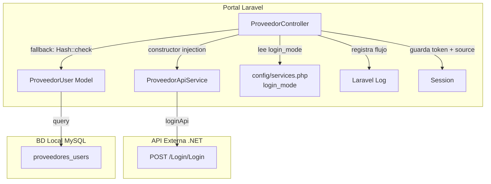
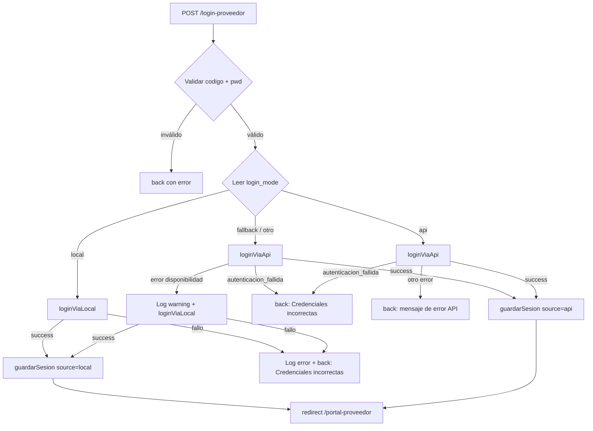

# Design Document: Login API con Fallback

## Overview

Este diseño describe cómo refactorizar el método `procesarLogin` del `ProveedorController` para que la autenticación de proveedores use primero la API externa (vía `ProveedorApiService::loginApi()`) con fallback automático a la base de datos local cuando la API no esté disponible. El modo de login es configurable vía variable de entorno `PROVEEDOR_LOGIN_MODE`.

### Decisiones de Diseño Clave

1. **Inyección de dependencias en constructor**: `ProveedorController` recibe `ProveedorApiService` por constructor injection (type-hint). Laravel resuelve automáticamente la dependencia vía service container.
2. **Modo de login configurable**: La variable `PROVEEDOR_LOGIN_MODE` (valores: `api`, `local`, `fallback`) se lee desde `config('services.proveedor_api.login_mode')` con default `fallback`. Valores no reconocidos se tratan como `fallback`.
3. **Fallback selectivo**: Solo errores de disponibilidad (`api_caida`, `timeout`, `error_servidor`, `error_desconocido`) disparan fallback. `autenticacion_fallida` NUNCA hace fallback — si la API rechaza las credenciales, se respeta esa decisión.
4. **Token en sesión**: El token JWT de la API se guarda en `proveedor_token` para llamadas subsecuentes. En login local, se guarda `null`.
5. **Login source en sesión**: `proveedor_login_source` indica `api` o `local` para que otros flujos del portal sepan qué datos usar.
6. **Logging estructurado**: Se registra en logs cada decisión del flujo (API exitosa, fallback activado, fallo total) con nivel apropiado (`info`, `warning`, `error`).
7. **Métodos privados extraídos**: Se extraen `loginViaApi()`, `loginViaLocal()` y `guardarSesion()` como métodos privados para mantener `procesarLogin` legible y testeable.

## Architecture



### Flujo de procesarLogin (modo fallback)



## Components and Interfaces

### 1. ProveedorController (refactorizado)

```php
class ProveedorController extends Controller
{
    private ProveedorApiService $apiService;

    public function __construct(ProveedorApiService $apiService);

    // Método público refactorizado
    public function procesarLogin(Request $request): RedirectResponse;

    // Métodos privados nuevos
    private function loginViaApi(string $codigo, string $pwd): ?array;
    private function loginViaLocal(string $codigo, string $pwd): ?array;
    private function guardarSesion(array $datosProveedor, string $source, ?string $token): void;
    private function getLoginMode(): string;

    // Métodos existentes sin cambios
    public function cerrarSesion(): RedirectResponse; // actualizado para limpiar nuevas claves
    // ... resto de métodos sin cambios
}
```

#### Firmas de métodos privados

**`loginViaApi(string $codigo, string $pwd): ?array`**
- Invoca `$this->apiService->loginApi($codigo, $pwd)`
- Si `success === true`: retorna `['id' => data.usuario, 'nombre' => data.usuario, 'codigo' => $codigo, 'correo' => data.usuario, 'token' => data.tokencreado]`
- Si `success === false`: retorna `null` (el caller decide si hacer fallback según `error_type`)
- Nota: La estructura exacta de `data.usuario` depende de la API de Alan. Se mapean los campos disponibles a las claves de sesión.

**`loginViaLocal(string $codigo, string $pwd): ?array`**
- Busca `ProveedorUser::where('usuario', $codigo)->first()`
- Si existe y `Hash::check($pwd, $proveedor->password)`: retorna `['id' => $proveedor->id, 'nombre' => $proveedor->nombre, 'codigo' => $proveedor->codigo_compras, 'correo' => $proveedor->correo, 'token' => null]`
- Si no existe o password no coincide: retorna `null`

**`guardarSesion(array $datosProveedor, string $source, ?string $token): void`**
- Guarda en sesión: `proveedor_id`, `proveedor_nombre`, `proveedor_codigo`, `proveedor_correo`, `proveedor_token`, `proveedor_login_source`

**`getLoginMode(): string`**
- Lee `config('services.proveedor_api.login_mode', 'fallback')`
- Si el valor no es `api`, `local` ni `fallback`, retorna `fallback`

### 2. Configuración actualizada (`config/services.php`)

```php
'proveedor_api' => [
    'url'             => env('PROVEEDOR_API_URL', ''),
    'connect_timeout' => (int) env('PROVEEDOR_API_CONNECT_TIMEOUT', 5),
    'timeout'         => (int) env('PROVEEDOR_API_TIMEOUT', 15),
    'max_retries'     => (int) env('PROVEEDOR_API_MAX_RETRIES', 3),
    'login_mode'      => env('PROVEEDOR_LOGIN_MODE', 'fallback'),
],
```

### 3. cerrarSesion actualizado

```php
public function cerrarSesion()
{
    session()->forget([
        'proveedor_id',
        'proveedor_nombre',
        'proveedor_codigo',
        'proveedor_correo',
        'proveedor_token',          // NUEVO
        'proveedor_login_source',   // NUEVO
    ]);

    return redirect('/login-proveedor')
        ->with('mensaje', 'Sesión cerrada correctamente');
}
```

## Data Models

### Sesión del Proveedor (después del login)

| Clave de sesión | Tipo | Fuente API | Fuente Local | Descripción |
|----------------|------|------------|--------------|-------------|
| `proveedor_id` | int/string | `data.usuario` (ID) | `$proveedor->id` | Identificador del proveedor |
| `proveedor_nombre` | string | `data.usuario` (nombre) | `$proveedor->nombre` | Nombre del proveedor |
| `proveedor_codigo` | string | `$codigo` (input) | `$proveedor->codigo_compras` | Código de compras |
| `proveedor_correo` | string | `data.usuario` (correo) | `$proveedor->correo` | Correo electrónico |
| `proveedor_token` | string\|null | `data.tokencreado` | `null` | Token JWT para API |
| `proveedor_login_source` | string | `'api'` | `'local'` | Fuente de autenticación |

### Configuración (.env) — nuevas variables

| Variable | Tipo | Default | Descripción |
|----------|------|---------|-------------|
| `PROVEEDOR_LOGIN_MODE` | string | `fallback` | Modo de login: `api`, `local`, `fallback` |

### Tipos de error que disparan fallback

| error_type | ¿Dispara fallback? | Razón |
|-----------|-------------------|-------|
| `api_caida` | ✅ Sí | API no disponible |
| `timeout` | ✅ Sí | API no respondió |
| `error_servidor` | ✅ Sí | Error 5xx en API |
| `error_desconocido` | ✅ Sí | Error inesperado |
| `autenticacion_fallida` | ❌ No | API rechazó credenciales explícitamente |
| `no_encontrado` | ❌ No | Usuario no existe en API |


## Correctness Properties

*A property is a characteristic or behavior that should hold true across all valid executions of a system — essentially, a formal statement about what the system should do. Properties serve as the bridge between human-readable specifications and machine-verifiable correctness guarantees.*

### Property 1: Modo de login inválido resuelve a fallback

*For any* string que no sea `api`, `local` ni `fallback`, el método `getLoginMode()` debe retornar `fallback`.

**Validates: Requirements 2.3**

### Property 2: Credenciales pasan intactas a loginApi

*For any* par de strings (codigo, pwd) no vacíos, cuando el modo de login es `api` o `fallback`, el método `loginApi()` del servicio debe ser invocado con exactamente esos mismos valores sin modificación.

**Validates: Requirements 3.1**

### Property 3: Integridad de sesión tras login por API

*For any* respuesta exitosa de `loginApi()` con `data.tokencreado` (string) y `data.usuario` (objeto), la sesión debe contener: `proveedor_token` igual a `data.tokencreado`, `proveedor_login_source` igual a `api`, y las claves `proveedor_id`, `proveedor_nombre`, `proveedor_codigo`, `proveedor_correo` pobladas con datos de la respuesta.

**Validates: Requirements 3.2, 3.3, 8.1, 9.1**

### Property 4: Invariante de sesión tras login local

*For any* `ProveedorUser` válido en la BD local que se autentique exitosamente, la sesión debe contener: `proveedor_token` igual a `null`, `proveedor_login_source` igual a `local`, y las claves `proveedor_id`, `proveedor_nombre`, `proveedor_codigo`, `proveedor_correo` pobladas con datos del modelo.

**Validates: Requirements 4.5, 4.6, 7.2, 8.2, 9.2**

### Property 5: Modo API nunca hace fallback

*For any* `error_type` retornado por `loginApi()` cuando el modo es `api`, el controller debe retornar error al usuario sin intentar autenticación contra la BD local.

**Validates: Requirements 6.2**

### Property 6: Modo local nunca invoca la API

*For any* par de credenciales (codigo, pwd), cuando el modo de login es `local`, el método `loginApi()` del servicio nunca debe ser invocado.

**Validates: Requirements 7.1**

## Error Handling

### Estrategia por Modo de Login

| Modo | Escenario | Acción |
|------|-----------|--------|
| `api` | API success | Login exitoso, source=api |
| `api` | API autenticacion_fallida | Error: "Credenciales incorrectas" |
| `api` | API cualquier otro error | Error: mensaje de la API |
| `fallback` | API success | Login exitoso, source=api |
| `fallback` | API autenticacion_fallida | Error: "Credenciales incorrectas" (NO fallback) |
| `fallback` | API caída/timeout/error_servidor/error_desconocido | Fallback a BD local |
| `fallback` | Fallback local exitoso | Login exitoso, source=local |
| `fallback` | Fallback local falla | Error: "Credenciales incorrectas" |
| `local` | BD local exitosa | Login exitoso, source=local |
| `local` | BD local falla | Error: "Credenciales incorrectas" |

### Errores que disparan fallback (solo en modo `fallback`)

```php
$erroresFallback = [
    ProveedorApiException::API_CAIDA,
    ProveedorApiException::TIMEOUT,
    ProveedorApiException::ERROR_SERVIDOR,
    ProveedorApiException::ERROR_DESCONOCIDO,
];
```

### Mensajes de Error al Usuario

| Situación | Mensaje flash |
|-----------|--------------|
| API rechaza credenciales | "Credenciales incorrectas" |
| BD local rechaza credenciales | "Credenciales incorrectas" |
| Modo API y API caída | Mensaje de la respuesta API (ej: "La API del proveedor no está disponible temporalmente") |
| Validación de formulario falla | Mensajes de validación de Laravel |

### Logging

| Nivel | Cuándo | Datos incluidos |
|-------|--------|----------------|
| `info` | Login API exitoso | código proveedor, source=api |
| `warning` | Fallback activado | código proveedor, error_type de API, source=local |
| `error` | Login falla completamente | código proveedor, motivo del fallo, modo de login |

## Testing Strategy

### Herramientas

- **PHPUnit 11.5** (ya instalado)
- **Mockery 1.6** (ya instalado) para mocks de ProveedorApiService
- **Laravel session helpers** para verificar datos de sesión
- **Laravel Log::fake()** para verificar logging
- **PHPUnit Data Providers** para property-based testing con generación de inputs

### Enfoque Dual: Unit Tests + Property Tests

**Unit Tests** (ejemplos específicos):
- Constructor injection funciona correctamente
- Modo `api`: login exitoso guarda sesión con source=api
- Modo `api`: API retorna autenticacion_fallida → error sin fallback
- Modo `api`: API retorna api_caida → error sin fallback
- Modo `fallback`: API exitosa → login por API
- Modo `fallback`: API caída → fallback a BD local exitoso
- Modo `fallback`: API caída + BD local falla → error
- Modo `fallback`: autenticacion_fallida → error sin fallback
- Modo `local`: login exitoso sin llamar API
- Modo `local`: login fallido → error
- cerrarSesion limpia proveedor_token y proveedor_login_source
- Logging: info en API exitosa, warning en fallback, error en fallo total

**Property Tests** (con PHPUnit Data Providers, mínimo 100 iteraciones):
- Property 1: Modo inválido → fallback
- Property 2: Credenciales pasan intactas a loginApi
- Property 3: Integridad de sesión tras login API
- Property 4: Invariante de sesión tras login local
- Property 5: Modo API nunca hace fallback
- Property 6: Modo local nunca invoca API

**Configuración de Property Tests:**
- Cada property test usa `@dataProvider` con generación aleatoria de al menos 100 casos
- Cada test incluye tag: `Feature: login-api-con-fallback, Property {N}: {título}`
- Se usa `Faker` para generar datos aleatorios (códigos, contraseñas, tokens, nombres)

### Estructura de Tests

```
tests/
├── Unit/
│   └── Controllers/
│       └── ProveedorControllerLoginTest.php   # Unit tests + Property tests del login
```

### Ejecución

```bash
php artisan test --filter=ProveedorControllerLogin
```
