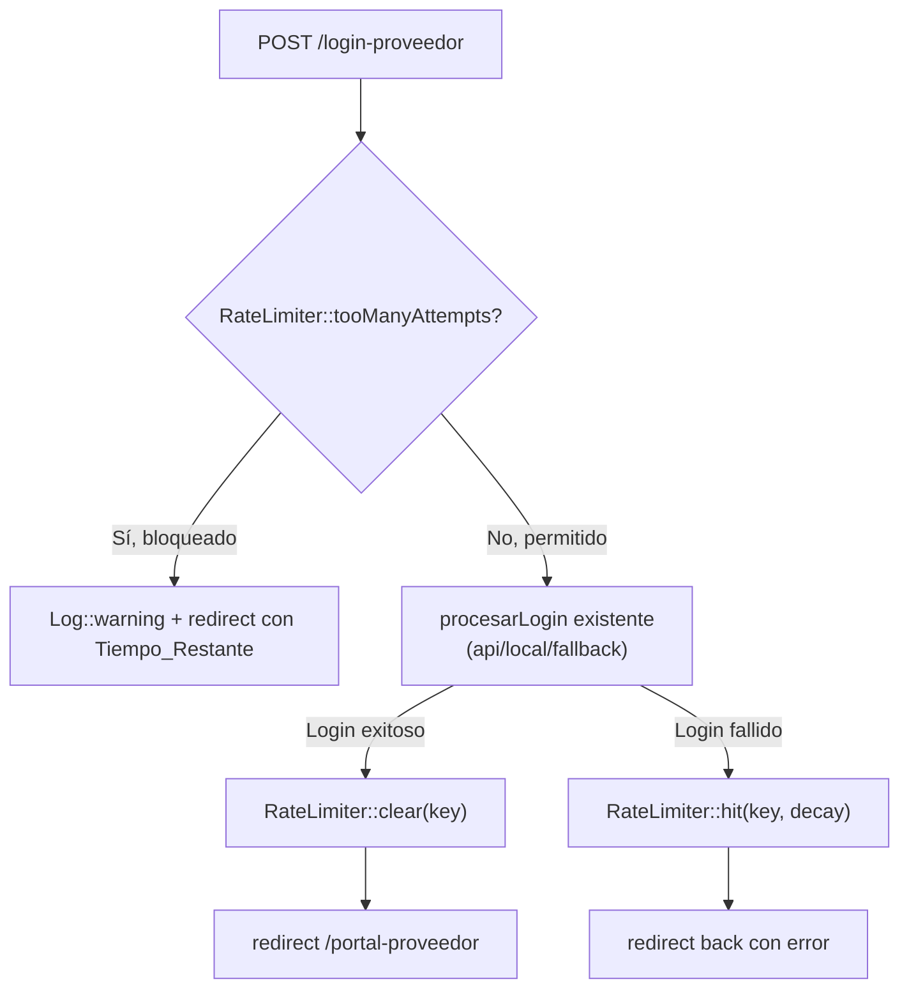
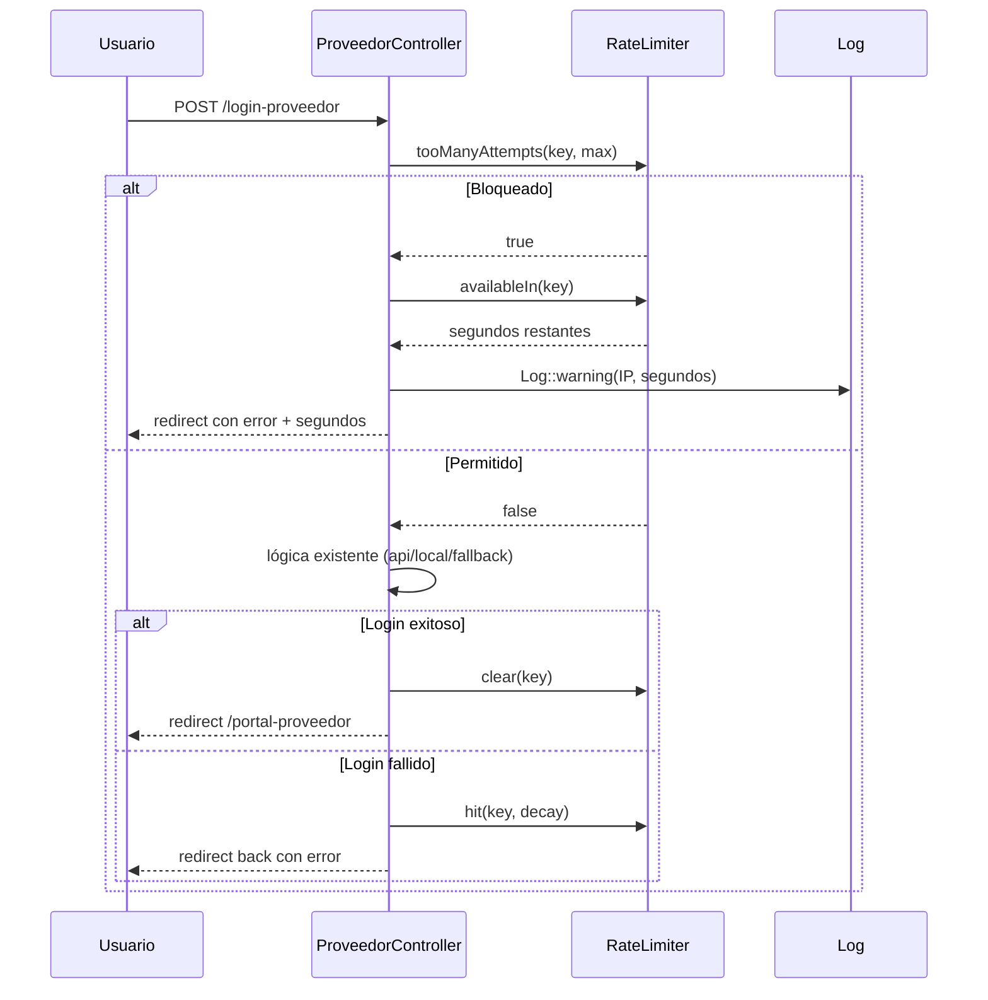

# Design Document: Login Rate Limiting

## Overview

Implementación de rate limiting en el login del Portal de Proveedores usando el facade `RateLimiter` nativo de Laravel. El sistema cuenta únicamente intentos fallidos por IP, bloquea temporalmente tras exceder el umbral configurable vía `.env`, muestra al usuario el tiempo restante, y registra intentos bloqueados en logs.

### Decisiones de Diseño Clave

1. **RateLimiter facade nativo**: Se usa `Illuminate\Support\Facades\RateLimiter` directamente en `procesarLogin()` en lugar de middleware de throttle. Esto permite contar solo intentos fallidos (no todos los requests) y limpiar el contador en login exitoso.
2. **Clave por IP**: La clave del rate limiter es `login-proveedor|{ip}` usando `$request->ip()`. Simple y efectivo para el caso de uso.
3. **Config vía .env**: `LOGIN_MAX_ATTEMPTS` y `LOGIN_DECAY_SECONDS` se leen desde `config('auth.rate_limiting')` con defaults 5 y 60 respectivamente.
4. **Verificación antes de procesar**: El check de rate limit ocurre al inicio de `procesarLogin()`, antes de validar credenciales contra API o BD. Si la IP está bloqueada, se rechaza inmediatamente.
5. **Hit solo en fallo**: `RateLimiter::hit()` se invoca únicamente cuando el login falla. En login exitoso se llama `RateLimiter::clear()`.
6. **Logging con nivel warning**: Los intentos bloqueados se registran con `Log::warning` incluyendo IP y segundos restantes.

## Architecture



### Integración con flujo existente

El rate limiting se integra como una capa al inicio de `procesarLogin()` sin modificar la lógica de modos (api/local/fallback):



## Components and Interfaces

### 1. ProveedorController — cambios en procesarLogin()

```php
use Illuminate\Support\Facades\RateLimiter;

public function procesarLogin(Request $request)
{
    $key      = 'login-proveedor|' . $request->ip();
    $maxAttempts  = config('auth.rate_limiting.max_attempts', 5);
    $decaySeconds = config('auth.rate_limiting.decay_seconds', 60);

    // Check rate limit ANTES de procesar credenciales
    if (RateLimiter::tooManyAttempts($key, $maxAttempts)) {
        $seconds = RateLimiter::availableIn($key);
        Log::warning('Login bloqueado por rate limiting', [
            'ip'               => $request->ip(),
            'segundos_restantes' => $seconds,
        ]);
        return back()
            ->with('error', "Demasiados intentos de inicio de sesión. Intenta de nuevo en {$seconds} segundos.")
            ->withInput();
    }

    // ... lógica existente de validación y modos ...

    // En cada punto de FALLO:
    RateLimiter::hit($key, $decaySeconds);

    // En cada punto de ÉXITO:
    RateLimiter::clear($key);
}
```

### 2. Configuración — config/auth.php

```php
'rate_limiting' => [
    'max_attempts'  => (int) env('LOGIN_MAX_ATTEMPTS', 5),
    'decay_seconds' => (int) env('LOGIN_DECAY_SECONDS', 60),
],
```

### 3. Vista login.blade.php

Sin cambios estructurales. El mensaje de bloqueo se muestra usando el mecanismo existente de `session('error')` con la clase `alert-error` ya definida. El mensaje incluye los segundos restantes dinámicamente.

## Data Models

### Configuración (.env) — nuevas variables

| Variable | Tipo | Default | Descripción |
|----------|------|---------|-------------|
| `LOGIN_MAX_ATTEMPTS` | int | `5` | Máximo de intentos fallidos antes de bloquear |
| `LOGIN_DECAY_SECONDS` | int | `60` | Ventana de tiempo en segundos para el bloqueo |

### Clave del Rate Limiter

| Campo | Formato | Ejemplo |
|-------|---------|---------|
| Clave | `login-proveedor\|{ip}` | `login-proveedor\|192.168.1.100` |

### Estado del Rate Limiter (gestionado por Laravel Cache)

| Dato | Tipo | Descripción |
|------|------|-------------|
| Intentos acumulados | int | Contador de intentos fallidos para la clave |
| Tiempo de expiración | timestamp | Momento en que el bloqueo expira automáticamente |
| Segundos restantes | int | Calculado por `RateLimiter::availableIn()` |


## Correctness Properties

*A property is a characteristic or behavior that should hold true across all valid executions of a system — essentially, a formal statement about what the system should do. Properties serve as the bridge between human-readable specifications and machine-verifiable correctness guarantees.*

### Property 1: Configuración de rate limiting es respetada

*For any* par de enteros positivos (maxAttempts, decaySeconds) configurados en las variables de entorno `LOGIN_MAX_ATTEMPTS` y `LOGIN_DECAY_SECONDS`, el rate limiter debe usar exactamente esos valores como umbral de bloqueo y ventana de tiempo respectivamente.

**Validates: Requirements 1.1, 1.2**

### Property 2: Intento fallido incrementa el contador

*For any* dirección IP y credenciales que resulten en login fallido, el contador de intentos asociado a esa IP debe incrementarse en exactamente 1.

**Validates: Requirements 2.1**

### Property 3: Login exitoso limpia el contador

*For any* dirección IP que tenga un contador de intentos fallidos mayor a cero, un login exitoso desde esa IP debe restablecer el contador a cero, permitiendo el máximo de intentos nuevamente.

**Validates: Requirements 2.2, 4.1**

### Property 4: Clave de rate limit usa la IP del cliente

*For any* dirección IP de cliente, la clave utilizada por el RateLimiter debe ser exactamente `login-proveedor|{ip}`.

**Validates: Requirements 2.3**

### Property 5: IP bloqueada rechaza login sin procesar credenciales

*For any* dirección IP que haya alcanzado el máximo de intentos fallidos, el siguiente intento de login debe ser rechazado inmediatamente con un redirect que incluya el tiempo restante en segundos, sin invocar la lógica de autenticación (API ni BD local).

**Validates: Requirements 3.1, 3.2**

### Property 6: Log de bloqueo contiene IP y tiempo restante

*For any* intento de login bloqueado por rate limiting, el log de nivel warning debe contener la dirección IP del cliente y los segundos restantes del bloqueo.

**Validates: Requirements 6.1, 6.2**

## Error Handling

### Escenarios de Rate Limiting

| Escenario | Acción | Mensaje al usuario |
|-----------|--------|--------------------|
| IP no bloqueada | Continuar con login normal | N/A |
| IP bloqueada | Rechazar inmediatamente | "Demasiados intentos de inicio de sesión. Intenta de nuevo en {N} segundos." |
| Login fallido (no bloqueado aún) | Incrementar contador + error normal | Mensaje de error existente del flujo de login |
| Login exitoso | Limpiar contador | Mensaje de bienvenida existente |

### Interacción con errores existentes

El rate limiting NO modifica los mensajes de error del flujo de login existente. Solo agrega un nuevo tipo de error (bloqueo por intentos) que se muestra antes de procesar credenciales. Los errores de "Credenciales incorrectas" y errores de API siguen funcionando igual.

### Logging

| Nivel | Cuándo | Datos incluidos |
|-------|--------|----------------|
| `warning` | Intento bloqueado por rate limiting | IP del cliente, segundos restantes |

Los logs existentes del flujo de login (info, warning, error) no se modifican.

## Testing Strategy

### Herramientas

- **PHPUnit 11.5** (ya instalado)
- **Laravel RateLimiter::fake() / Cache mocking** para controlar el estado del rate limiter
- **Laravel Log::fake()** para verificar logging
- **PHPUnit Data Providers** para property-based testing con generación de inputs
- **Faker** para generar IPs, credenciales y valores de configuración aleatorios

### Enfoque Dual: Unit Tests + Property Tests

**Unit Tests** (ejemplos específicos):
- Defaults: sin variables de entorno, max_attempts=5 y decay_seconds=60
- Login fallido incrementa contador
- Login exitoso limpia contador
- IP bloqueada recibe redirect con mensaje y segundos
- IP bloqueada no procesa credenciales (API/BD no se invocan)
- Mensaje de bloqueo usa session('error') con formato correcto
- Log::warning se registra al bloquear con IP y segundos
- Después de expirar el bloqueo, se permiten nuevos intentos

**Property Tests** (con PHPUnit Data Providers, mínimo 100 iteraciones):
- Property 1: Config de rate limiting es respetada
- Property 2: Intento fallido incrementa contador
- Property 3: Login exitoso limpia contador
- Property 4: Clave de rate limit usa IP del cliente
- Property 5: IP bloqueada rechaza login sin procesar credenciales
- Property 6: Log de bloqueo contiene IP y tiempo restante

**Configuración de Property Tests:**
- Cada property test usa `@dataProvider` con generación aleatoria de al menos 100 casos
- Cada test incluye tag: `Feature: login-rate-limiting, Property {N}: {título}`
- Se usa `Faker` para generar datos aleatorios (IPs, credenciales, valores de config)

### Estructura de Tests

```
tests/
├── Unit/
│   └── Controllers/
│       └── ProveedorControllerRateLimitTest.php   # Unit tests + Property tests
```

### Ejecución

```bash
php artisan test --filter=ProveedorControllerRateLimit
```
