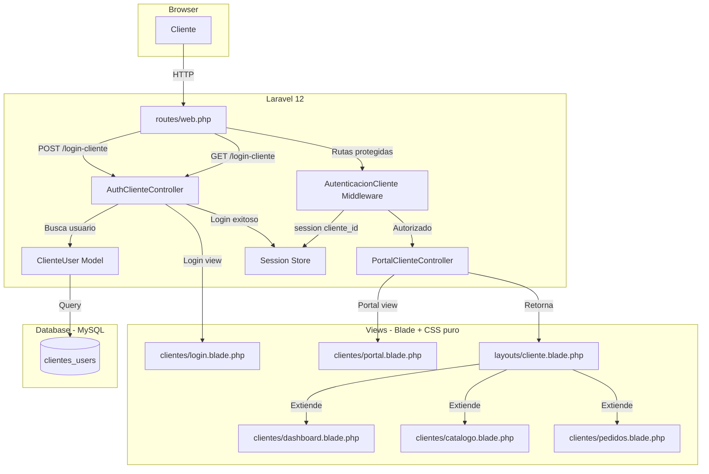
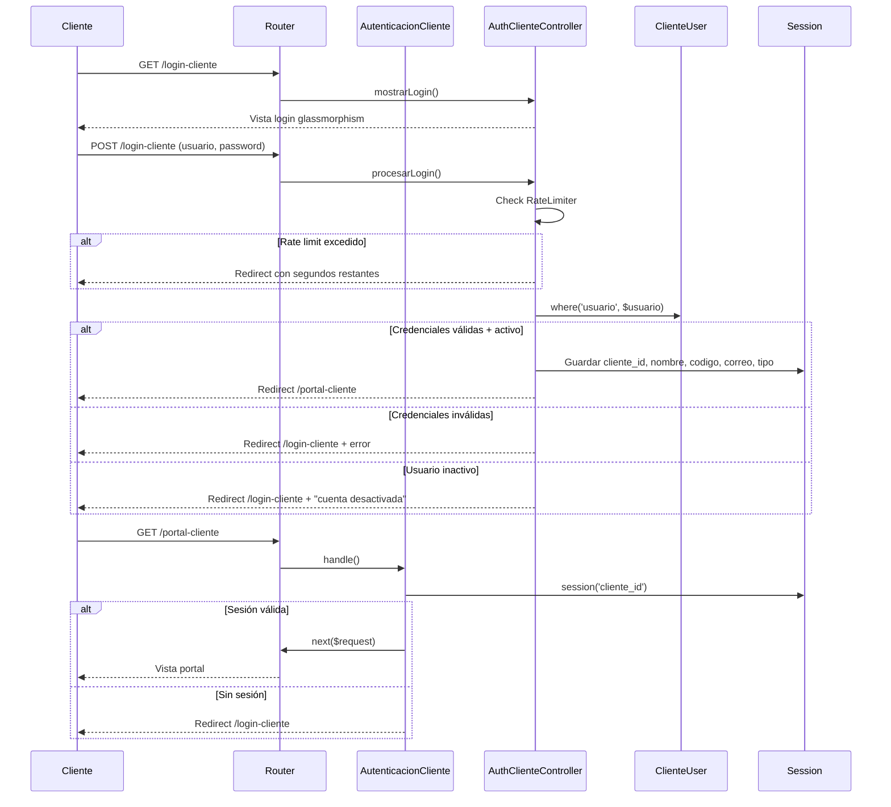

# Design Document — Portal de Clientes Base

## Overview

El Portal de Clientes es un módulo dentro del mismo codebase de Laravel 12 que replica la arquitectura del Portal de Proveedores existente, adaptado para clientes de Industrias Salcom. Los clientes son dados de alta manualmente por Salcom (sin registro público). El portal usa autenticación basada en sesión con middleware dedicado, controladores separados, modelo Eloquent independiente y vistas Blade con CSS puro.

La arquitectura sigue un patrón 1:1 con el portal de proveedores:
- `ProveedorUser` → `ClienteUser`
- `AutenticacionProveedor` → `AutenticacionCliente`
- `AuthProveedorController` → `AuthClienteController`
- `PortalProveedorController` → `PortalClienteController`
- `layouts/proveedor.blade.php` → `layouts/cliente.blade.php`
- Vistas en `proveedores/` → Vistas en `clientes/`

## Architecture



### Flujo de autenticación



## Components and Interfaces

### 1. Migración `create_clientes_users_table`

Crea la tabla `clientes_users` con campos específicos para clientes (tipo_cliente, credito_autorizado, limite_credito, rfc, codigo_cliente). Incluye índices en `usuario`, `correo` y `codigo_cliente`.

### 2. Modelo `ClienteUser`

```php
class ClienteUser extends Authenticatable
{
    use SoftDeletes;
    protected $table = 'clientes_users';
    protected $fillable = ['nombre', 'correo', 'usuario', 'password', 'telefono',
        'rfc', 'tipo_persona', 'codigo_cliente', 'tipo_cliente',
        'credito_autorizado', 'limite_credito', 'activo'];
    protected $hidden = ['password'];
    protected $casts = ['activo' => 'boolean', 'credito_autorizado' => 'boolean'];
}
```

### 3. Middleware `AutenticacionCliente`

Verifica `session('cliente_id')`. Si no existe, redirige a `/login-cliente` con mensaje flash. Registrado como alias `auth.cliente` en `bootstrap/app.php`.

### 4. Form Request `LoginClienteRequest`

Valida campos `usuario` (required) y `password` (required). Sigue el patrón de `LoginProveedorRequest`.

### 5. Controlador `AuthClienteController`

| Método | Ruta | Descripción |
|--------|------|-------------|
| `mostrarLogin()` | GET `/login-cliente` | Retorna vista login |
| `procesarLogin(LoginClienteRequest)` | POST `/login-cliente` | Valida credenciales, rate limiting, guarda sesión |
| `cerrarSesion()` | POST `/logout-cliente` | Limpia sesión, redirige a login |

Login simplificado vs proveedores: solo autenticación local (sin API externa, sin fallback). Rate limiting idéntico: 5 intentos/min por IP usando `RateLimiter`.

### 6. Controlador `PortalClienteController`

| Método | Ruta | Vista |
|--------|------|-------|
| `mostrarPortal()` | GET `/portal-cliente` | `clientes.portal` |
| `mostrarDashboard()` | GET `/cliente/dashboard` | `clientes.dashboard` |
| `mostrarCatalogo()` | GET `/cliente/catalogo` | `clientes.catalogo` |
| `mostrarPedidos()` | GET `/cliente/pedidos` | `clientes.pedidos` |

### 7. Rutas en `web.php`

Bloque separado con comentario `// ── Portal de Clientes ──`. Rutas públicas (login GET/POST, logout POST) y rutas protegidas con middleware `auth.cliente`.

### 8. Vistas Blade

| Vista | Tipo | Descripción |
|-------|------|-------------|
| `layouts/cliente.blade.php` | Layout | Navbar blanco, sidebar colapsable, hero band, footer |
| `clientes/login.blade.php` | Standalone | Glassmorphism morado, sin enlace de registro |
| `clientes/portal.blade.php` | Standalone | Navbar horizontal, sidebar hover, cards resumen |
| `clientes/dashboard.blade.php` | Extiende layout | Métricas mockeadas |
| `clientes/catalogo.blade.php` | Extiende layout | Mensaje "API pendiente" |
| `clientes/pedidos.blade.php` | Extiende layout | Tabla vacía con columnas |

### 9. Seeder `ClienteUserSeeder`

Crea 2 clientes de prueba (mayorista y minorista) con `updateOrCreate`. Registrado en `DatabaseSeeder`.

## Data Models

### Tabla `clientes_users`

| Columna | Tipo | Constraints |
|---------|------|-------------|
| id | bigint unsigned | PK, auto-increment |
| nombre | string | not null |
| correo | string | not null |
| usuario | string | unique, not null |
| password | string | not null |
| telefono | string | nullable |
| rfc | string | nullable |
| tipo_persona | string | nullable |
| codigo_cliente | string | nullable |
| tipo_cliente | string | nullable (mayorista, minorista, distribuidor) |
| credito_autorizado | boolean | default false |
| limite_credito | decimal(12,2) | nullable |
| activo | boolean | default true |
| remember_token | string | nullable |
| created_at | timestamp | nullable |
| updated_at | timestamp | nullable |
| deleted_at | timestamp | nullable (SoftDeletes) |

**Índices:** `usuario` (unique), `correo` (index), `codigo_cliente` (index)

### Sesión del cliente

| Clave | Origen |
|-------|--------|
| `cliente_id` | `ClienteUser->id` |
| `cliente_nombre` | `ClienteUser->nombre` |
| `cliente_codigo` | `ClienteUser->codigo_cliente` |
| `cliente_correo` | `ClienteUser->correo` |
| `cliente_tipo` | `ClienteUser->tipo_cliente` |


## Correctness Properties

*A property is a characteristic or behavior that should hold true across all valid executions of a system — essentially, a formal statement about what the system should do. Properties serve as the bridge between human-readable specifications and machine-verifiable correctness guarantees.*

### Property 1: Login round-trip preserva datos de sesión

*For any* ClienteUser activo con cualquier combinación válida de nombre, correo, codigo_cliente y tipo_cliente, cuando el login es exitoso con credenciales correctas, la sesión SHALL contener exactamente los valores `cliente_id`, `cliente_nombre`, `cliente_codigo`, `cliente_correo` y `cliente_tipo` correspondientes al usuario autenticado.

**Validates: Requirements 4.2, 4.3**

### Property 2: Credenciales inválidas son rechazadas

*For any* ClienteUser y cualquier string de password que no coincida con el hash almacenado, el login SHALL redirigir con error, no almacenar `cliente_id` en sesión, y conservar el input previo.

**Validates: Requirements 4.4**

### Property 3: Rate limiting bloquea después del límite

*For any* secuencia de N intentos fallidos de login desde la misma IP donde N > 5, el intento N+1 SHALL ser bloqueado con un mensaje indicando los segundos restantes, sin verificar credenciales.

**Validates: Requirements 4.6, 4.7**

### Property 4: Logout limpia completamente la sesión

*For any* sesión autenticada de cliente (con cliente_id, cliente_nombre, cliente_codigo, cliente_correo, cliente_tipo), después de ejecutar logout, la sesión SHALL no contener ninguna de esas claves y la respuesta SHALL redirigir a `/login-cliente`.

**Validates: Requirements 4.8**

## Error Handling

| Escenario | Comportamiento | Mensaje |
|-----------|---------------|---------|
| Credenciales inválidas | Redirect a login con input | "Credenciales incorrectas" |
| Cuenta desactivada | Redirect a login | "Tu cuenta está desactivada. Contacta a Salcom." |
| Rate limit excedido | Redirect a login | "Demasiados intentos. Intenta en {N} segundos." |
| Acceso sin sesión | Redirect a login | "Debes iniciar sesión para acceder al portal" |
| Ruta no encontrada | 404 | Vista de error existente |

## Testing Strategy

### Tests de integración (PHPUnit Feature Tests)

Archivo: `tests/Feature/FlujoCompletoClienteTest.php`

Sigue el patrón exacto de `FlujoCompletoProveedorTest.php`:
- Usa `RefreshDatabase` trait
- Método helper `crearCliente()` que crea un `ClienteUser` con `Hash::make`
- Tests del flujo completo: login → portal → dashboard → catálogo → pedidos
- Tests de middleware: rutas protegidas redirigen sin sesión
- Tests de logout: limpia sesión y redirige
- Tests de credenciales incorrectas
- Tests de cuenta inactiva
- Tests de rate limiting

### Property-Based Tests (PHPUnit con generadores manuales)

Dado que PHP no tiene una librería PBT madura como fast-check o QuickCheck, los property tests se implementan como tests parametrizados con datos generados aleatoriamente usando `Faker` dentro de loops de 100 iteraciones.

Archivo: `tests/Feature/ClientePropertyTest.php`

Cada property test:
- Ejecuta mínimo 100 iteraciones
- Genera datos aleatorios con `Faker`
- Incluye tag de referencia al property del diseño
- Formato del tag: `Feature: portal-clientes-base, Property {N}: {título}`

**Property 1**: Login round-trip — genera 100 ClienteUsers con datos aleatorios, verifica que la sesión almacena los valores correctos después de login.

**Property 2**: Credenciales inválidas — genera 100 passwords aleatorios incorrectos, verifica que todos son rechazados.

**Property 3**: Rate limiting — genera secuencias de 6+ intentos fallidos, verifica que el 6to es bloqueado.

**Property 4**: Logout cleanup — genera 100 sesiones con datos aleatorios, verifica que logout limpia todas las claves.

### Cobertura por requisito

| Requisito | Tipo de test |
|-----------|-------------|
| R1 (Migración) | Smoke: verificar tabla y columnas |
| R2 (Modelo) | Example: verificar configuración del modelo |
| R3 (Middleware) | Example + Integration: redirect sin sesión, pass con sesión |
| R4 (Auth Controller) | Property (1-4) + Integration: flujo completo |
| R5 (Portal Controller) | Integration: status 200 en cada ruta |
| R6 (Rutas) | Smoke: verificar existencia de rutas |
| R7 (Layout) | Example: verificar elementos del layout |
| R8 (Login vista) | Example: verificar formulario y alertas |
| R9 (Portal vista) | Example: verificar cards y sidebar |
| R10 (Vistas mock) | Example: verificar contenido placeholder |
| R11 (Seeder) | Example: verificar datos creados |
| R12 (Tests integración) | Integration: flujo completo end-to-end |
